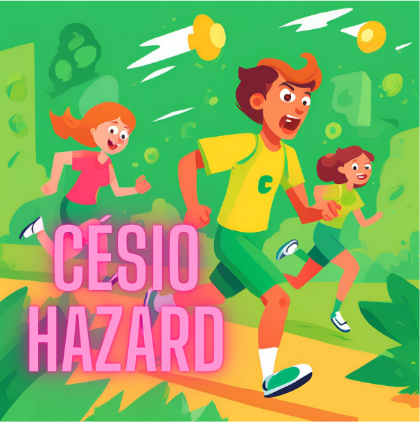
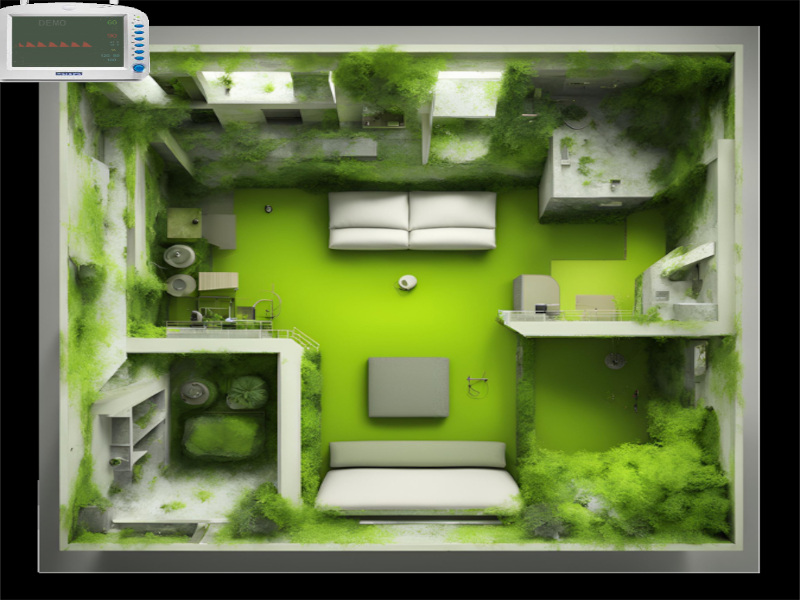

# Césio Hazard


Em um dia aparentemente normal, Dotorzin, um renomado pesquisador, recebe uma notícia alarmante: um vazamento de Césio 137 ocorreu no 15º andar do centro clínico onde está localizado o seu laboratório. Ao abrir a porta do laboratório, ele se depara com o caos. A radiação se espalhou rapidamente, e algumas atendentes, expostas ao material contaminado, estão desorientadas e aflitas, perseguindo-o em busca de ajuda.


Agora, Dotorzin tem uma única missão: descer os 15 andares do prédio e alcançar a saída no térreo antes que a exposição prolongada o coloque em risco fatal.


No entanto, a jornada não será fácil. As atendentes, contaminadas e desesperadas, tentam alcançá-lo a qualquer custo, enquanto os corredores do prédio estão repletos de barreiras e obstáculos que tornam a fuga ainda mais desafiadora.


Dotorzin deve evitar o contato direto com as atendentes, pois cada interação reduz sua saúde, aproximando-o de um estado crítico. Ele também precisa superar as barreiras e perigos no caminho, mantendo-se rápido e estratégico para não ser encurralado.


A tensão aumenta a cada andar. Se Dotorzin conseguir descer todos os 15 andares e alcançar o térreo, ele estará salvo e terá vencido o jogo. Mas se sua saúde for gravemente afetada antes de escapar, ele sucumbirá às consequências da radiação, e será o fim de sua jornada.



Você está pronto para ajudar Dotorzin a escapar desse pesadelo radioativo?


## Requisitos
- Python >= 3.x
- `pip` para gerenciar dependências
- PgZero
- Pygame (para uso da classe `Rect`)

## Instalação
1. Clone o repositório:
   ```bash
   git clone git@github.com:ml5w3s/cesio-hazard.git
# Jogo de Sobrevivência Top-Down

Um jogo simples inspirado em mecânicas de sobrevivência top-down, onde o jogador precisa, acessar uma porta, para passar de sala, evitando inimigos que o perseguem e causam dano ao chegar muito perto.

## Como Jogar

- **Movimento**: Use as setas do teclado para mover o jogador (azul) pela tela.
- **Objetivo**: Chegar na 15º sala e sobreviver, enquanto evita os inimigos (verde), contornando as barreiras.
- **Dano**: Se um inimigo se aproximar muito, o jogador perde saúde.

## Como Executar

1. Certifique-se de que as dependências estão instaladas:
   ```bash
   pip install pgzero
   cd cesio-hazard
   pgzrun /src/cesio_oo.py
